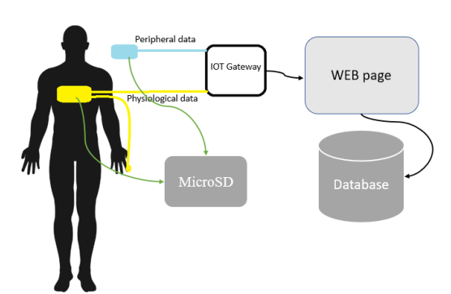
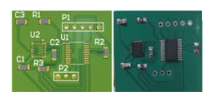
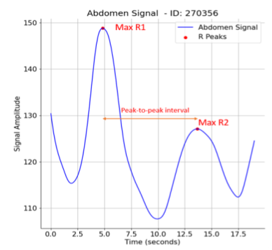
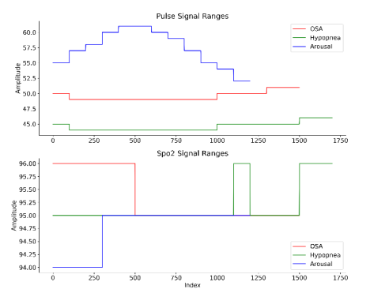
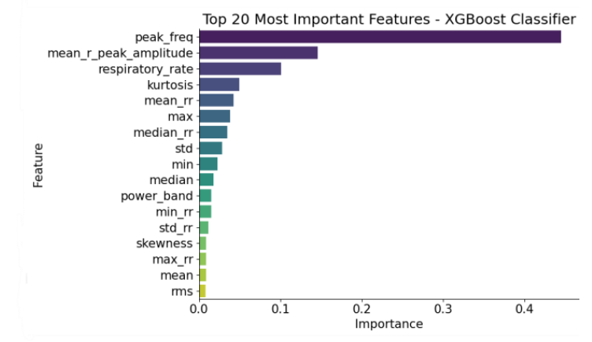

<html>

<head>
    <title>Innovative Approach to Sleep Apnea Detection and Classification</title>
</head>
<body>
  

  

<body>

<h1>Innovative Approach to Sleep Apnea Detection and Classification</h1>

<strong>Introduction</strong>

Sleep apnea is a common sleep disorder that affects millions of people worldwide. It is characterized by recurrent interruptions in breathing during sleep, leading to fragmented sleep patterns and a range of health issues. Accurate detection and classification of sleep apnea events are crucial for effective diagnosis and treatment. In this essay, we will explore a groundbreaking research paper that presents an innovative approach to addressing this challenge by utilizing non-invasive recording devices and advanced machine learning techniques.

  

  

<strong>The Paper's Approach</strong>

The paper under discussion introduces a novel method for detecting and classifying sleep apnea, arousal, and hypopnea events. Instead of invasive procedures or costly equipment, the authors propose using a non-invasive recording device that relies on three key physiological signals: respiratory rate, SpO2 (oxygen saturation), and heart rate (HR). These signals are fundamental in understanding respiratory effort and function during sleep.

  

  

<strong>Data Source and Preprocessing</strong>

To validate their approach, the researchers based their study on the APPLES dataset, a publicly available repository containing recordings of 120 patients with sleep apnea who underwent overnight polysomnography. The paper details their data preprocessing steps, which included extracting time and frequency domain features from the respiratory signals. They used wavelet decomposition and denoising techniques to enhance the quality of the abdomen effort signal, ensuring accurate and reliable data for analysis.

  

  

<strong>Machine Learning Models</strong>

One of the strengths of this research lies in its application of machine learning models, specifically the support vector machine (SVM) and the gradient boosting algorithm (XGBoost). The authors employed grid search for hyperparameter optimization, a technique to fine-tune the models for optimal performance. The results demonstrated the power of these models in accurately classifying sleep apnea events.

<strong>Performance Metrics</strong>

The paper evaluates the performance of their approach using Receiver Operating Characteristic (ROC) curves and other metrics. Notably, the overall area under the curve (AUC) reached an impressive 0.89, showcasing the effectiveness of their classification method. Additionally, the XGBoost model achieved an accuracy of 0.8673 and an F1-score of 0.8670, indicating robust performance in distinguishing between different sleep events.

  

  

<strong>Comparison with Existing Methods</strong>

To validate the superiority of their approach, the authors compared their results with existing methods that utilize different vital signals, such as SpO2 and HR. The comparison revealed that their approach consistently outperformed existing techniques, with higher AUC values for apnea (0.9), arousal (0.88), and hypopnea (0.82) using SpO2 signals, and even more impressive values using HR signals (apnea 0.92, arousal 0.91, and hypopnea 0.86). This suggests that their method is not only innovative but also more accurate in classifying sleep apnea-related events.

<strong>Conclusion</strong>

The paper discussed in this essay presents a pioneering approach to sleep apnea detection and classification. By utilizing non-invasive recording devices and machine learning models, the researchers have achieved remarkable results, outperforming existing methods in accurately identifying sleep apnea, arousal, and hypopnea events. This work has significant implications for the field of sleep medicine, offering a non-invasive and effective solution for diagnosing and managing sleep disorders, ultimately improving the quality of life for individuals affected by sleep apnea. As technology and research in this area continue to advance, we can expect further innovations that will enhance our understanding and treatment of sleep-related health issues.

</body>
</html>

    

</body>
</html>
