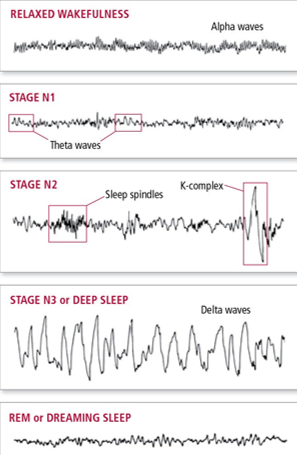

EEG preprocessing is a crucial step in the analysis of electroencephalography (EEG) data, which are recordings of the electrical activity of the brain. EEG data are often contaminated by various sources of noise and artifact, such as eye blinks, muscle movements, power line interference, and environmental factors. These unwanted signals can distort the true neural activity and affect the validity and reliability of the results. Therefore, EEG preprocessing aims to remove or reduce the noise and artifact from the raw EEG data, while preserving the signal of interest. This can enhance the signal-to-noise ratio and improve the detection of brain responses to stimuli or tasks. EEG preprocessing also involves standardizing and organizing the data for further analysis, such as extracting features, applying statistical tests, or performing machine learning. In this essay, we will review the main methods and challenges of EEG preprocessing, and discuss some examples of how it can influence the outcomes of EEG research.

<html>
<head>
    <title>The Happe Pipeline: EEG Preprocessing for Robust Data Analysis</title>
    
</head>
<body>
    <h1>The Happe Pipeline: EEG Preprocessing for Robust Data Analysis</h1>

    

        <h2>Introduction</h2>
        
EEG (Electroencephalography) is a powerful tool for studying brain activity in both research and clinical settings. However, before EEG data can be analyzed, it often requires thorough preprocessing to ensure the removal of artifacts and the extraction of meaningful signals. One well-regarded EEG preprocessing pipeline is the Happe pipeline. In this essay, we will explore the Happe pipeline and its essential steps, emphasizing its significance in EEG research.

        
 Happe pipeline for EEG preprocessing. It is a standardized, automated pipeline that can process EEG data from raw files to processed EEG suitable for time-frequency-domain analyses. It is specially designed for developmental and high-artifact data, such as those from young children or those with neurodevelopmental disorders.

        

        <h2>The Happe Pipeline in Four Steps</h2>
        
The Happe pipeline consists of four main steps: pre-process, check, generate, and validate. Each step plays a crucial role in preparing EEG data for meaningful analysis.

        
1. <strong>Pre-process</strong>: In this initial step, the raw EEG data undergoes a series of transformations. It includes filtering the data to remove noise and artifacts, identifying and removing bad channels and epochs, interpolating missing channel data, and re-referencing the data to a common reference point.

        
2. <strong>Check</strong>: The check step allows the user to interactively inspect the pre-processed data. Researchers can manually review the data and make adjustments to processing parameters if necessary. This hands-on quality control ensures that the data is prepared to the highest standards.

        

        
3. <strong>Generate</strong>: The generating step involves the extraction of specific features of interest from the pre-processed EEG data. This can include event-related potentials (ERPs) or resting-state power spectra, depending on the research objectives. These extracted features are vital for subsequent analyses.

        
4. <strong>Validate</strong>: The final step, validate, compute data quality metrics and generate comprehensive reports for each processed EEG file. This transparency is essential for documenting the quality of the data and the preprocessing steps, ensuring rigor and reproducibility in EEG research.

        

        <h2>Advantages of the Happe Pipeline</h2>
        
The Happe pipeline has been shown to outperform seven alternative processing approaches in terms of removing more artifacts and preserving more signals in EEG data. This makes it particularly valuable for datasets with challenging characteristics, such as those from young children or individuals with neurodevelopmental disorders.

        
Additionally, the Happe pipeline provides a consistent and transparent way of reporting data quality measures. This is crucial for EEG research, as the quality of the data greatly influences the reliability of subsequent analyses. By offering a standardized approach, the Happe pipeline promotes best practices and ensures that researchers can trust their results.

        <h2>Conclusion</h2>
        
In the realm of EEG research, the Happe pipeline stands as a robust and reliable tool for data preprocessing. Its four-step approach, including pre-processing, checking, generating, and validating, ensures that EEG data is cleaned, analyzed, and validated with the utmost precision. Researchers can have confidence in the quality of their data and the transparency of their methods, ultimately leading to more meaningful insights into brain activity.

        
The availability of the Happe pipeline as open-source software under the terms of the GNU General Public License further underscores its significance in advancing EEG research, making it a valuable asset for the scientific community.

    

</body>
</html>

Source: <a href="https://github.com/jogarces/ics-313-text-game"><i class="large github icon "></i>jogarces/ics-313-text-game</a>
