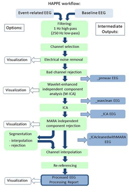
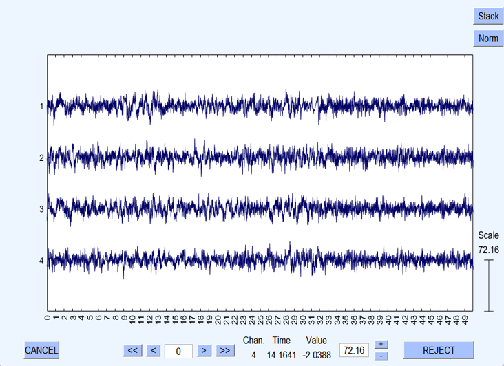

<html>
<head>
    <title>Dimension Reduction in AI and Deep Learning</title>
      
</head>
<body>
  
<h1>Dimension Reduction in AI and Deep Learning</h1>
    

        <h2>Introduction</h2>
 
    
    
Dimension reduction is a fundamental technique in AI and deep learning that plays a crucial role in simplifying complex data representations. In AI, especially in tasks like image and text processing, data often contains a vast number of features or dimensions, which can lead to challenges such as increased computational complexity and overfitting. Dimension reduction methods aim to mitigate these issues by transforming high-dimensional data into a lower-dimensional space while preserving essential information.

      
    
One widely used dimension reduction technique in deep learning is Principal Component Analysis (PCA). PCA identifies the directions in the data that capture the most variance and projects the data onto a lower-dimensional subspace, allowing for a more compact representation. This technique is particularly useful in image and feature engineering tasks, where it can reduce the computational burden and improve model performance.

        

     
    
In deep learning, autoencoders are another popular dimension reduction approach. Autoencoders consist of an encoder network that compresses the input data into a lower-dimensional representation (latent space) and a decoder network that reconstructs the original data from this representation. By training autoencoders, models can learn to capture the most important features of the data, effectively reducing its dimensionality while preserving critical information. This is invaluable in applications like image denoising and data compression, where dimension reduction aids in efficient storage and transmission of data.

        

        <h2>Advantages of the Happe Pipeline</h2>
        
The Happe pipeline has been shown to outperform seven alternative processing approaches in terms of removing more artifacts and preserving more signals in EEG data. This makes it particularly valuable for datasets with challenging characteristics, such as those from young children or individuals with neurodevelopmental disorders.

        
Additionally, the Happe pipeline provides a consistent and transparent way of reporting data quality measures. This is crucial for EEG research, as the quality of the data greatly influences the reliability of subsequent analyses. By offering a standardized approach, the Happe pipeline promotes best practices and ensures that researchers can trust their results.

        <h2>Conclusion</h2>
        
In the realm of EEG research, the Happe pipeline stands as a robust and reliable tool for data preprocessing. Its four-step approach, including pre-processing, checking, generating, and validating, ensures that EEG data is cleaned, analyzed, and validated with the utmost precision. Researchers can have confidence in the quality of their data and the transparency of their methods, ultimately leading to more meaningful insights into brain activity.

        
The availability of the Happe pipeline as open-source software under the terms of the GNU General Public License further underscores its significance in advancing EEG research, making it a valuable asset for the scientific community.

    

</body>
</html>

Source: <a href="https://github.com/PINE-Lab/HAPPE" target="_blank">GitHub repository</a> dedicated to this topic.

You can learn more at the [UH Micromouse News Announcement](https://manoa.hawaii.edu/news/article.php?aId=2857).
