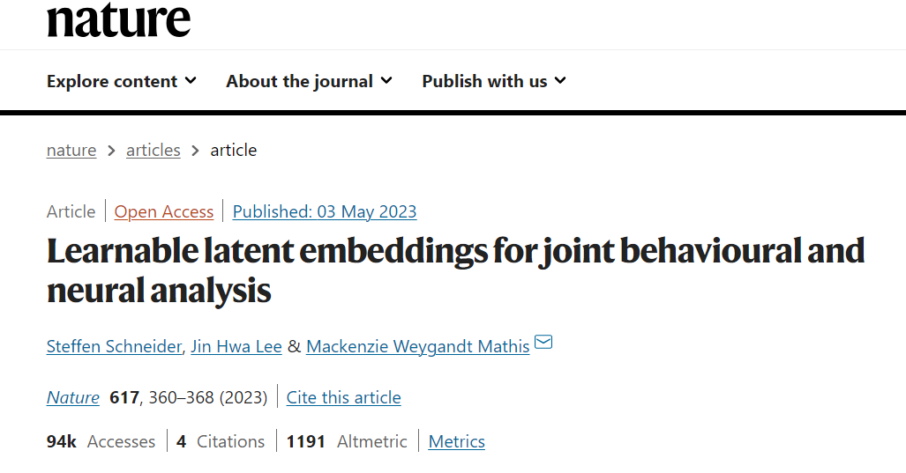

<html>
<head>
    <title>Dimension Reduction in AI and Deep Learning</title>
</head>
<body>
  

  

<h1>Dimension Reduction in AI and Deep Learning</h1>
    

        <h2>Introduction</h2>
 
    
Dimension reduction is a fundamental technique in AI and deep learning that plays a crucial role in simplifying complex data representations. In AI, especially in tasks like image and text processing, data often contains a vast number of features or dimensions, which can lead to challenges such as increased computational complexity and overfitting. Dimension reduction methods aim to mitigate these issues by transforming high-dimensional data into a lower-dimensional space while preserving essential information.

    
One widely used dimension reduction technique in deep learning is Principal Component Analysis (PCA). PCA identifies the directions in the data that capture the most variance and projects the data onto a lower-dimensional subspace, allowing for a more compact representation. This technique is particularly useful in image and feature engineering tasks, where it can reduce the computational burden and improve model performance.

    
In deep learning, autoencoders are another popular dimension reduction approach. Autoencoders consist of an encoder network that compresses the input data into a lower-dimensional representation (latent space) and a decoder network that reconstructs the original data from this representation. By training autoencoders, models can learn to capture the most important features of the data, effectively reducing its dimensionality while preserving critical information. This is invaluable in applications like image denoising and data compression, where dimension reduction aids in efficient storage and transmission of data.

        
        <h2>Learnable latent embeddings for joint behavioral and neural analysis</h2>
        
It is a research paper by Steffen Schneider, Jin Hwa Lee, and Mackenzie Weygandt Mathis, published in Nature in May 20231. The paper proposes a novel method called CEBRA, which stands for Consistent EmBeddings of high-dimensional Recordings using Auxiliary variables. The method uses self-supervised learning to jointly analyze behavioral and neural data in a non-linear way, and produces latent spaces that reveal underlying correlates of behavior. The paper demonstrates the utility of CEBRA for various datasets and tasks in neuroscience, such as mapping of space, kinematic features, and natural movies.

        
        
Neuroscience is a field that aims to understand how the brain generates behavior. However, analyzing the complex and high-dimensional data from behavioral and neural experiments is a challenging task. Traditional methods often rely on linear models or hand-crafted features, which may not capture the non-linear and dynamic relationships between behavior and neural activity. In this paper, the authors propose a novel method called CEBRA, which stands for Consistent EmBeddings of high-dimensional Recordings using Auxiliary variables. CEBRA uses self-supervised learning to jointly analyze behavioral and neural data in a non-linear way and produces latent spaces that reveal underlying correlates of behavior. CEBRA leverages auxiliary variables, such as time or stimulus identity, to enforce consistency across different modalities and conditions. The authors demonstrate the utility of CEBRA for various datasets and tasks in neuroscience, such as mapping of space, kinematic features, and natural movies. They show that CEBRA can discover meaningful latent factors that are shared or specific to behavior and neural activity and can be used for downstream analysis such as decoding or clustering.

        <video class="img-fluid" controls>
            <source src="../img/41586_2023_6031_MOESM4_ESM.mp4" type="video/mp4">
        </video>
        

        You can find the paper here: <a href="https://manoa.hawaii.edu/news/article.php?aId=2857">UH Micromouse News Announcement</a>.
    

</body>
</html>
